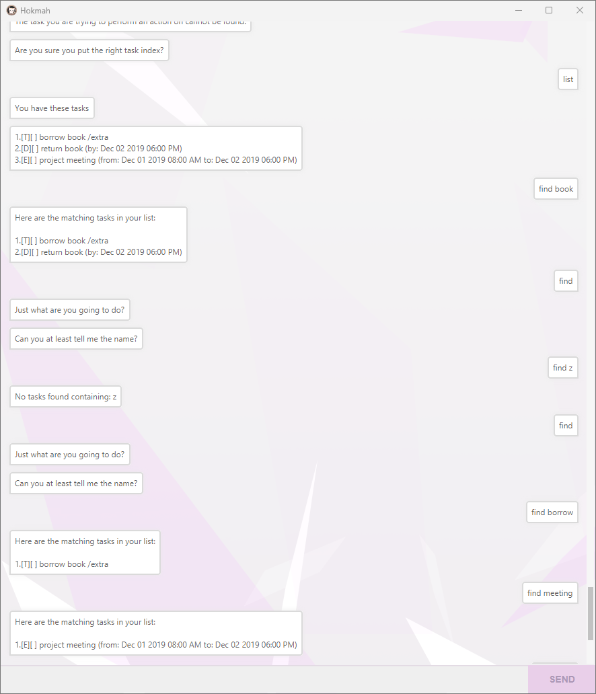
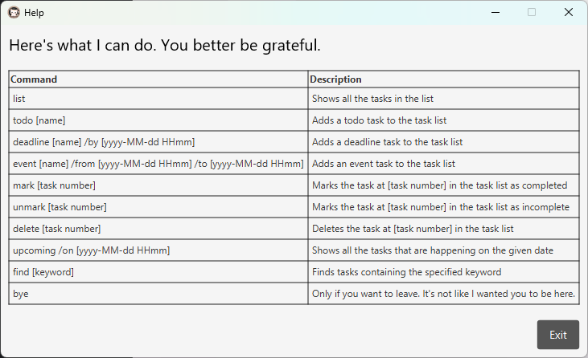

# Hokmah User Guide

Hokmah is a task management chatbot that supports four types of tasks: `todo`, `deadline`, `event`. It is designed for users who prefer typing commands to manage their tasks efficiently.



(The mouse in the screenshot is intentional)

---
## Installation

1. **Download the JAR file**:
    - Download the latest version of Hokmah from the [Hokmah Releases](https://github.com/Ryuse/ip/releases/) page.

2. **Run the Application**:
    - Double-click the downloaded JAR file, or open a terminal and navigate to the directory where the JAR file is located. Then, run the following command:
      ```bash
      java -jar Hokmah-v0.2.jar
      ```

## Features Overview

Hokmah supports the following commands:

- `todo`: Add a todo task.
- `deadline`: Add a deadline task.
- `event`: Add an event task.
- `list`: List all tasks.
- `find`: Find tasks by keyword.
- `upcoming`: Find tasks by end time.
- `delete`: Delete a task.
- `mark`: Mark a task as complete.
- `unmark`: Mark a task as incomplete.
- `help`: Show help window.
- `bye`: Exit the application.
---
## Adding Tasks

### Adding a Todo

Adds a todo task with a specified description to the task list.

**Command format**:
```text
todo <description>
```

**Example**:
```text
todo eat ice cream
```

**Response**:
```
I've added this task:
[T][ ] eat ice cream
Now you have 1 tasks in the list! What else do you want?
```

### Adding a Deadline

Adds a deadline task with a specified description and due date to the task list.

**Command format**:
```text
deadline <description> /by <byDatetime>
```

- `byDatetime` must be in 24-hour `yyyy-MM-dd HHmm` format.

**Example**:
```text
deadline return book /by 2019-12-02 1800
```

**Response**:
```
I've added this task:
[D][ ] return book (by: Dec 2 2019 6:00pm)
Now you have 1 tasks in the list. What else do you want?
```

### Adding an Event

Adds an event task with a specified description, start time, and end time to the task list.

**Command format**:
```text
event <description> /from <fromDateTime> /to <toDateTime>
```

- `fromDateTime` and `toDateTime` must be in 24-hour `yyyy-MM-dd HHmm` format.
- The `/from` argument must come before the `/to` argument.

**Example**:
```text
event project meeting /from 2019-12-01 0800 /to 2019-12-02 1800
```

**Response**:
```
I've added this task:
[E][ ] project meeting (from: Dec 2 2019 6:00pm to: Dec 4 2019 8:00am)
Now you have 3 tasks in the list!
```
---
## Viewing Tasks
### Listing All Tasks

Displays all tasks in the task list.

**Command format**:
```text
list
```

**Response**:
```
You have these tasks
1. [T][ ] eat ice cream
2. [D][ ] return book (by: Dec 2 2019 6:00pm)
3. [E][ ] project meeting (from: Dec 1 2019 8:00am to: Dec 2 2019 6:00pm)
```

### View Tasks by name

Finds tasks that contain a specified keyword in their description.

**Command format**:
```text
find <keyword>
```

**Example**:
```text
find book
```

**Response**:
```
Here are the matching tasks in your list:

1. [D][ ] return book (by: Dec 2 2019 6:00pm)
```

### View Upcoming Tasks by Date

View upcoming tasks that occur on a specific date.

**Command format**:
```text
upcoming /on <dateTime>
```

- `dateTime` must be in `yyyy-MM-dd HHmm` format.

**Example**:
```text
upcoming /on 2019-12-02 1800
```

**Response**:
```
Your upcoming tasks on Dec 2 2019 are:

2. [D][ ] return book (by: Dec 2 2019 6:00pm)
3. [E][ ] project meeting (from: Dec 1 2019 8:00am to: Dec 2 2019 6:00pm)
You have 1 upcoming task(s). It's coming soon. Like your doom.
```
---
## Deleting a Task

Removes a task from the task list using its index.

**Command format**:
```text
delete <index>
```

**Example**:
```text
delete 1
```

**Response**:
```
Ok sure, I've removed this task
[T][ ] eat ice cream
What else do you want?
```
---
## Marking Tasks

### Marking a Task as Complete

Marks a task as complete using its index.

**Command format**:
```text
mark <index>
```

**Example**:
```text
mark 1
```

**Response**:
```
Bleh! I've masked this task as done!
[T][X] eat ice cream
Are you happy?
```

### Marking a Task as Incomplete

Marks a task as incomplete using its index.

**Command format**:
```text
unmark <index>
```

**Example**:
```text
unmark 1
```

**Response**:
```
So you have not done this task yet?
[T][ ] eat ice cream
That's sad. I've masked it as such.
```
---
## Showing the help
Command format:

```
bye
```
Response:


---

## Exiting the Application

Exits the Hokmah application.

**Command format**:
```text
bye
```

**Response**:
```
Goodbye!
I hope you don't come back soon!
ヾ(＾ ∇ ＾).
```

---

This guide provides a comprehensive overview of Hokmah's features and commands. 